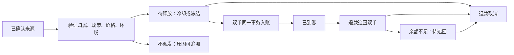

# 直属购买与设备收益双币分成契约

## 授权、目标与范围

主人已确认：A 直接邀请 B，B 购买设备及设备实际收益均可给 A 分成；每笔总分成拆为 USDT 与 NEX；两类规则独立在后台配置；平台额外支付，B 原收益不减少。B 邀请 C 时，C 的这两类分成只给 B，不沿邀请链继续给 A。主人明确保留二元对碰、V 等级、培育奖、领导池及其原有计算；这些独立奖励仍可能产生间接利益。“仅直属”只约束本契约的两类分成，不得扩大成停用其他 Team 功能。

本契约覆盖后端、运营后台、正式 App 与共享 H5。主人已授权先形成详细方案、同步各仓 PRD，随后实施、测试及验收。未授权部署生产、替运营方设置正式费率、修改真实资金或历史已生效权益。

## 基本事实与不变量

- 邀请归属以服务端 nx_user.sponsor_user_id 为权威。每笔业务只有一个直接受益人；不递归、不压缩层级、不从失效邀请人继续向上找。
- 购买以已付款设备订单的实付 USDT 为基数；普通/组合订单、换购、容量替换、保留旧机购新及试用转正必须同口径。充值、试用充值本身、赠送与券抵扣不计；零实付不派奖。
- 设备收益以已入账设备结算凭证中的 USDT 与 NEX 为基数。免费手机的真实合格任务与已购设备同样按事实计算；试用影子收益、注册礼、活动奖励、邀请佣金、团队奖励、开发模拟及测试工作器产出不进入正式奖励。
- 邀请奖励自身不得再触发设备收益分成。因此 C 给 B 的佣金不会再给 A 发奖。
- 购买和设备收益分别配置总比例与双币拆分，平台承担新增奖励，B 的实付和设备原收益不因该奖励再次扣款。
- 二元、等级、培育、领导池、原有邀请注册礼保持原规则。历史 network 佣金可查询、释放或处置，不删除旧账。
- 新结算不经过旧七层 network 引擎，也不叠加其 promo、Influence 或层级系数。新功能关闭、配置缺失或失败时不得回退七层派佣。
- 金额用十进制计算，最终向下取六位。受益人、来源、政策、汇率和两币金额保存不可变快照；后改比例不改变旧账。

## 计算规则

令 p 为有效 NEX 价格，单位 USDT/NEX，必须大于零；复用已有服务端 NEX 价格能力及后台配置，不建设第二套行情。每笔保存 p。购买基数 Q=订单实付 USDT；设备基数 Q=该凭证已入账 USDT+已入账 NEX×p。总比例 r=totalRatePct/100，USDT占比 s=usdtSharePct/100：

```
USDT 奖励 = floor6(Q × r × s)
NEX 奖励  = floor6(Q × r × (1-s) / p)
```

价格不可用时不套默认价，保留待处理/失败回执并允许重试。两币均达到可记账精度才形成可发放奖励；任一币舍入为零时保留小额未发原因和原始计算事实，不抬高金额、不伪造双币到账。已有小额累积能力如不存在，不新增资金累积产品。

示例只用于测试：p=0.01，购买实付1000、r=10%、s=60%时为60 USDT+4000 NEX；设备实际收益10 USDT、r=5%、s=60%时为0.3 USDT+20 NEX，设备本人仍收10 USDT。

#### [FEAT-DR01] 直属奖励计算、发放与撤销

**① 用户故事**：作为直接邀请人，我想查看直接成员有效购买与设备实际产出的双币分成，以便逐笔核对奖励来源和到账状态；作为财务运营，我想追溯重复投递、冻结和退款，以便避免重复付款或账实不符。

**② 验收 GWT 与异常路径**：Given A→B→C→D，When 各自购买或完成设备结算，Then 每个来源只奖励直接邀请人，A 不能因 C 的这两类来源得到奖励，其他独立 Team 奖励仍运行。Given B 已获得设备收益，When A 分成到账，Then B 两币余额与本人原收益不减少。

- 异常1：Given 同一订单/凭证被并发投递或重新生成事件ID，When 重试，Then 只生成同一份结算和两币明细；修改政策或邀请关系后重试也不改变原受益人和金额。
- 异常2：Given 第二币入账失败，When 发放事务回滚，Then 第一币、第二币、佣金状态、钱包和账本均不得留下半成功记录；失败可安全重试。
- 异常3：Given 无有效价格、跨环境身份、失效邀请人或风险冻结，When 结算，Then 不产生可消费余额，保留可区分的原因；不得把失败伪装为成功，不向更上层代发。
- 异常4：Given 购买退款，When 原奖励未发放，Then 取消原双币奖励；已发放则按原金额和原价格实际追回双币并记反向账本。余额不足时记录尚待追回金额，不把仅改状态当追回成功，不阻止购买者应得退款。
- 异常5：Given 当前设备退款只有全额确认事实，When 输入未经支持的部分退款比例，Then 拒绝且不改变钱包；全额退款重试仅追回尚欠部分，累计不超过原奖励。本版不新增部分退款能力。

**③ 数据字典与生成规则**：所有金额、归属、状态和凭证均服务端权威，client 仅 UI cache。

| 字段 | 类型 | 必填 | 规则 |
|---|---|---|---|
| settlementNo | string | 是 | 服务端生成；双币共享同一结算号 |
| sourceType | enum | 是 | direct_purchase / direct_device_earning |
| sourceRef | string | 是 | 订单号或真实设备结算凭证号，不用随机事件ID代替 |
| sourceEnvironment / runId | enum/string | 是 | 生产与沙箱隔离；来源、成员、邀请人、钱包一致 |
| sourceUserId / beneficiaryUserId | bigint | 是 | 结算来源本人和当笔直接邀请人，内部审计字段不公开暴露成员ID |
| sourceDeviceId | string/null | 否 | 设备收益关联真实设备 |
| sourceOccurredAt | UTC instant | 是 | 选择生效政策的业务确认时间，不能用重试时间 |
| policyVersion / policySnapshot | long/json | 是 | 不可变政策快照 |
| basisUsdt / nexUsdtPrice | decimal | 是 | 正基数与有效价格快照 |
| amountUSDT / amountNEX | decimal | 是 | 两币最终应发数量 |
| releaseAt / status | UTC instant/enum | 是 | 发放条件与结算状态 |
| recoveryPendingUSDT / recoveryPendingNEX | decimal | 是 | 默认0；已撤销但尚未实际追回的金额 |

来源唯一性为环境、运行批次、来源类型及来源编号；每个来源只允许一个受益人，改上级不能产生第二笔。单币奖励入口的 sourceRef 另附 :USDT 或 :NEX，兼容已有不含 asset 的来源唯一键。政策版本不得放入防重唯一键。

**④ 状态机与禁止动作**：



公开状态沿用 cooling/unlocked/frozen/reversed/rejected，增加 recovery_pending；未入钱包不得显示已到账或可提现。冻结/冷却保留在结算层，满足风险与等待条件后才进入钱包，不依赖仅保护 USDT 提现的旧逻辑冒充双币冻结。F5、自动解锁、后台改状态、补发、冲正必须路由同一结算动作；一币明细操作必须按整组处理，不能绕开另一币。禁止丢弃钱包动作后单独标成功；禁止负可用余额；待追回不可重复补发。

直属来源不提供复制补发：失败只能恢复原来源并保持唯一快照，不能新增一份奖励。退款或人工冲正均进入撤回路径，reversalRecorded 表示该状态；已撤回来源不得重发。旧奖励的原有补发规则保持。

**⑤ 交互四态**：默认态展示真实双币金额和来源；空状态说明尚无直属奖励；加载态保留原列表结构并阻止重复请求；报错态保留筛选与重试入口，冻结、冷却、待追回均有可读状态，不显示内部错误码。

**⑥ 点击流矩阵**：

| 触发元素 | 目标 | 反馈 |
|---|---|---|
| 奖励来源 | 原订单或当前收益明细 | 仅在权限允许且真实路由存在时可跳转，否则当前页展示来源编号 |
| 重试加载 | 当前查询 | 保留期间、重试失败明确提示 |
| F5 发放/冻结/撤销 | 同一结算组 | 权限、理由、并发校验；失败不得假成功 |

**⑦ 跨文档一致性**：App PRD 的推荐收益、Team 版税页、佣金列表、公式和数据模型引用本规则；后台 PRD F2/F5 引用同一政策和状态。二元、等级、培育与领导池章节仅补独立性边界，不改其参数或公式。

#### [FEAT-DR02] 后台整组政策与审批

**① 用户故事**：作为具有 F2 配置权限的运营者，我想分别配置购买与设备收益的总比例及双币拆分，以便控制平台奖励支出；作为审批者，我想核对改前改后及资金影响，以便批准完整一致的政策版本。

**② 验收 GWT 与异常路径**：Given 有配置权限且通过现有 A2/B1 流程，When 提交两规则完整快照与理由并完成审批，Then 同一版本原子生效，GET读回一致，刷新仍在，未来来源使用正确版本。

- 异常1：Given expectedVersion 已过期，When 提交或审批重放，Then 拒绝覆盖并要求刷新；不部分写入任一规则。
- 异常2：Given 权限缺失、理由无效、拆分越界、额外传入生效时间/价格或 Idempotency-Key 缺失，When 直调接口，Then 服务端拒绝；UI禁用及提示不能代替服务端检查。
- 异常3：Given 资金放大且 B1 不满足，When 审批，Then 拒绝扩大；停用、减小总比例等收缩不能被误当放大；改变拆分时同时比较两币有效支出率。
- 异常4：Given 重复审批或并发提交，When 重放，Then 仅同一版本一次生效，失败原因与操作审计可查。

**③ 数据字典与参数**：

| 字段 | 类型 | 默认/范围 | 生效 |
|---|---|---|---|
| policyVersion / expectedVersion | integer | 初始0 / 非负 | 整组CAS，批准后递增 |
| effectiveAt | ISO UTC | 未配置null；实际生效时间由服务端在A2批准成功时生成 | 来源发生时间选择版本，延迟审批不倒填历史奖励；本版不提供定时生效 |
| purchase.enabled / deviceEarning.enabled | boolean | 默认false | 各自控制新计提，关闭不恢复七层 |
| totalRatePct | decimal | 未配置0；0..100，启用时大于0 | 每类独立 |
| usdtSharePct | decimal | 未配置占位50；启用时严格大于0且小于100 | NEX自动为100减该值 |
| coolingDays | integer | 未配置0；0..365 | 计提时快照 |
| reason | string | 8..200字 | 服务端审计，非空 |
| nexUsdtPrice | decimal/null | 引用现有有效 NEX 价格 | 不作为此表单第二套行情；每笔保存快照 |

以上未配置值仅为禁用表单占位，不是生产奖励承诺。GET配置无价格时可返回null，App显示暂不可用；结算必须等待有效价格。PUT 不接受客户端传入NEX价格或NEX拆分的另一独立比例。

API：

- GET /api/config/commission/direct-referral：公开只读当前生效政策，source、serverCanonical、sourceEnvironment、runId、configured、policyVersion、effectiveAt、nexUsdtPrice、purchase、deviceEarning。purchase/deviceEarning 两对象恒在，未配置时为禁用占位。
- GET /api/admin/teams/direct-referral-policy：F2读取权限，返回同一当前生效政策；待审批操作通过既有 A2 查询。
- PUT /api/admin/teams/direct-referral-policy：要求 Idempotency-Key、expectedVersion、purchase、deviceEarning、reason，复用 network_f2_royalty_rate 权限及现有 A2；无客户端effectiveAt入参，服务端以实际批准时间生成生效点，未经确认/审批不得直写生效。
- A2 操作标识 f_direct_referral_policy，目标 direct_referral_policy/current；服务器重新校验权限、版本、参数与资金方向，不信任客户端 amplifies。

**④ 状态机与禁止动作**：编辑草稿→确认理由与影响→待审批→批准生效/拒绝。审批使用同一整组快照；禁止逐字段跨版本生效、过期版本覆盖、无批准直接执行、未启用时静默套用旧10%规则。

**⑤ 交互四态**：默认态为现有 F2 页面两行配置与当前版本；空状态显示未配置且停用；加载态保留表单结构、禁止提交；报错态保留草稿、提供重载及冲突说明，输入校验在对应字段显示。

**⑥ 点击流矩阵**：

| 触发元素 | 目标 | 反馈 |
|---|---|---|
| 两类开关/比例/等待期 | 当前草稿 | 原生数值/选择控件，拆分合计100%，无字符串多值输入 |
| 提交审批 | 现有业务确认弹窗 | 显示两组改前改后、理由、资金影响、取消 |
| 确认 | A2 | 防重复、明确待审批，不误报已生效 |
| 取消 | 当前草稿 | 不提交，草稿保留 |
| 刷新 | 服务端GET | 明确版本冲突，不静默覆盖有改动草稿 |

**⑦ 跨文档一致性**：政策属于后台 F2；A2审批、B1覆盖率、D4账本、F5处置及既有 NEX 价格各复用原归属；后台 PRD F2 的目的、参数、操作、接口、权限审计、风控联动及事件均同步。不为此新增独立配置平台。

#### [FEAT-DR03] App/H5 直属分成与历史兼容

**① 用户故事**：作为邀请人，我想在现有 Team 入口分别查看购买、设备收益分成和双币到账状态，以便理解实际奖励；同时仍能使用今日对碰、等级、培育奖和本周领导池。

**② 验收 GWT 与异常路径**：Given 合法直属奖励，When 打开 /team/unilevel 对应现有页面，Then 显示直属分成、两类规则和两类真实金额，列表按结算组展示；Team其他入口仍可操作，历史network在总佣金列表保留。

- 异常1：Given 配置未启用或价格暂缺，When 打开页面，Then 显示明确状态且历史已发生奖励可查，不回退本地七层mock或固定10%。
- 异常2：Given 网络失败/协议不符，When 重试，Then保留期间并给错误反馈，不显示旧账号或旧环境数据。
- 异常3：Given 切换账号或期间时旧请求晚返回，When 更新页面，Then拒绝过期响应；分页使用同一snapshotAt，聚合不得只累计当前页。
- 异常4：Given zh/en/vi、亮暗主题、窄屏和H5环境，When 浏览及刷新，Then双币、长数值、状态和重试正常；H5仍无手机执行/心跳权限。

**③ 数据字典与接口**：GET /api/app/team/insights/direct-referral?period=month&page=1&pageSize=20&snapshotAt=...，沿用现有TeamInsights认证、分页、UTC期间及来源校验。period=today/week/month/all；page>=1，pageSize=1..100。

| 字段 | 类型 | 规则 |
|---|---|---|
| source/serverCanonical | string/boolean | server/true |
| sourceEnvironment/runId | string/string | 沿用TeamInsights环境约束；生产runId为空字符串 |
| page/pageSize/totalRows | integer | 整个快照总数，非当前页长度 |
| generatedAt/snapshotAt | ISO string/string或null | 沿用现有UTC快照约定 |
| split.purchase / split.deviceEarning | object | amountUSDT、amountNEX、count，整个期间聚合 |
| events | array | 每个来源一条双币组记录，不把双币数成两个成员 |
| event.id/kind | string/enum | settlementNo；direct_purchase/direct_device_earning |
| event.sourceUserName | string | 脱敏；公开禁止原始sourceUserId |
| event.sourceRef/sourceDeviceId | string/string或null | 真实关联来源 |
| event.policyVersion/basisUsdt/nexUsdtPrice | number | 原结算快照 |
| event.amountUSDT/amountNEX | decimal | 两币金额 |
| event.status | enum | cooling/unlocked/frozen/reversed/rejected/recovery_pending |
| event.ts/unlockAt | epoch milliseconds | 与现有佣金模型一致 |
| event.recoveryPendingUSDT/recoveryPendingNEX | decimal | 待追回余额 |

总佣金接口和后台 F5 在原6类之上增加上述两类，原network/unilevel历史保留；分类汇总、导出与允许列表同步。奖金榜既有“已完成合法佣金”口径纳入新类型，按真实净到账计，撤销/未到账不得充作奖励。

总佣金继续使用现有单币账项列表，新组的USDT与NEX分别为两条账项，不强制旧接口带整组字段；其total代表账项数量，不作奖励笔数或成员人数。直属专页按上述新接口将两币合为一笔结算展示，F5在原账项上关联同组快照与安全处置。

**④ 状态机与禁止动作**：idle→loading→ready/empty/error；重试从error到loading；账号变更清除旧快照。禁止客户端本地计算可提现额、用旧七层数据代替新响应、丢弃失败态或伪造配置成功。

**⑤ 交互四态**：默认态沿用已有页面结构展示两类规则与列表；空状态显示无奖励并保留邀请入口；加载态沿用骨架/占位；报错态有重试和返回，冻结/冷却不标可提现，窄屏金额不溢出。

**⑥ 点击流矩阵**：

| 触发元素 | 目标 | 反馈 |
|---|---|---|
| Team直属分成入口 | 既有/team/unilevel | 加载新政策及直属快照 |
| 期间切换 | 当前页 | 重置分页并重新取得快照 |
| 加载更多 | 当前页同snapshotAt | 追加并去重，失败可重试 |
| 规则说明 | 既有unilevel-how/commissions-how | 读取同步后的已发布说明，不泄露内部算法与错误码 |
| 今日对碰/本周领导池/等级 | 原页面 | 原功能及其规则保持 |
| 返回/重试 | 上一页/当前查询 | 明确可达 |

**⑦ 跨文档一致性**：正式App PRD推荐收益、Team、数据模型、公式、验收章节以及APP落地规格同步；H5通过既有受控同步同步相同契约；三语言说明和后端published模板一致，禁止残留“L1固定10%、七层购买分成”作为新政策说明。关系网络可以显示既有关系，但不得暗示这些间接层在新规则中产生直属分成。

## 验收入口

实施步骤见 IMPLEMENTATION.md；验收场景与证据要求见 ACCEPTANCE.md；可执行用例映射见 TEST-CASES.md；交互演练见 interaction.html。文档完成不代表代码、数据库或生产部署完成，实际执行结果另存运行报告。
