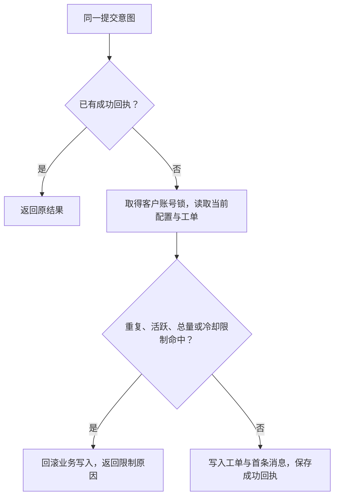

# 工单创建策略

## 目的与适用范围

同一客户账号的所有正式建单入口共用一个服务端预算，避免连点、重试或切换入口生成多张相同工单。限制只决定能否创建新工单，不阻断既有工单的合法回复、关闭或重开；各动作仍须通过原有身份、归属、状态和版本校验。

| 入口 | 接口 |
|---|---|
| App 直接建单 | `POST /api/app/support/tickets` |
| App 会话转工单 | `POST /api/app/support/conversations/{conversationNo}/ticket` |
| 后台直接建单 | `POST /api/admin/content/tickets` |
| 后台会话转工单 | `POST /api/admin/content/conversations/{conversationNo}/ticket` |

四类入口都经 `MybatisSupportTicketRepository.createTicket` 执行创建策略。策略按客户账号计数，不按操作者、客户端或入口分别计数；后台入口不享有额外建单额度。验收沙箱使用隔离数据链，不作为正式建单入口。

四类入口的工单负责人统一取当前专属客服；无绑定进入既有待分配流程。具体创建、转绑和历史作者规则见[工单专属客服归属](support-ticket-ownership.md)。

## 可控参数

| 配置键 | 默认值 | 允许范围 | 生效与影响 |
|---|---:|---|---|
| `support.ticket.creation.cooldown_seconds` | 60 | 整数 1–86400 秒 | 下一次策略读取或建单判断使用当前有效配置 |
| `support.ticket.creation.max_per_24h` | 10 | 整数 1–1000 | 同账号滚动 24 小时内允许创建的总数 |
| `support.ticket.creation.max_active` | 3 | 整数 1–1000 | 同账号已有活跃工单达到该数时阻止新建 |

配置经 `PlatformConfigFacade.activeValue` 读取。缺失、停用、软删除、格式错误或超出范围时使用对应默认值并记录告警，不解除限制。滚动窗口固定为 24 小时，不按自然日或客户端日期重置。配置初始化使用 `INSERT IGNORE`，保留已经存在的配置值与状态。

## 判定规则

每次判定先锁定客户账号，再读取服务端当前时间与最新数据。同账号的并发建单依次判断，成功创建及首条消息写入处于同一事务内。

1. **重复内容**：检查过去 24 小时内同账号的工单。分类去除首尾空白并转小写；标题及首条正文先做 Unicode NFC 规范化，再将连续 Unicode 空白合并为一个空格并去除首尾空白。三项均相同则拒绝再次创建，并返回已有工单号。标题和正文保持大小写区别，后续回复不改变用于比较的首条正文。
2. **活跃数量**：统计 `is_deleted=0` 且状态为 `OPEN`、`IN_PROGRESS`、`PENDING_USER` 的工单，达到配置上限即拒绝。仅归档仍计入活跃数量；`RESOLVED`、`CLOSED` 不计入。
3. **滚动总量**：统计 `created_at > 当前时间 - 24 小时` 的全部工单，包含已关闭、归档和软删除记录。达到上限即拒绝；这些操作均不返还窗口内的次数。下调上限后，须等待足够数量的旧记录离开窗口才恢复创建。
4. **相邻冷却**：当前时间早于最近一次创建时间加冷却秒数时拒绝。
5. 以上均通过后创建工单，使用取得账号锁后判定的时间作为创建时间。

会话转工单若被策略拒绝，整个转换事务回滚，不留下已关闭的源会话、转换关联或半张工单。

## 策略接口与失败结果

`GET /api/app/support/tickets/creation-policy` 根据当前登录账号返回策略，响应设置 `Cache-Control: no-store`。预检查不占用名额，也不接受草稿内容，因此重复内容在真正提交时判断。

| 字段 | 含义 |
|---|---|
| `allowed` / `reasonCode` | 当前是否可创建；允许时原因码为 `null` |
| `retryAfterSeconds` / `retryAt` | 服务端计算的等待秒数与可重试时间；没有可推算时间时为 `0` / `null` |
| `existingTicketNo` | 可继续处理的已有工单号；无匹配时为 `null` |
| `cooldownSeconds` / `windowHours` | 当前冷却秒数与窗口小时数 |
| `maxCreatedInWindow` / `maxActiveTickets` | 当前总量与活跃上限 |
| `createdInWindow` / `activeTickets` | 当前已创建数量与活跃数量 |

提交拒绝由 `SupportTicketCreationRejectedException` 携带完整策略，响应体为 `ApiResult`，策略位于 `data`。

| 原因码 | HTTP 状态 | 返回动作依据 |
|---|---:|---|
| `SUPPORT_TICKET_CREATE_DUPLICATE` | 409 | `existingTicketNo` 指向匹配工单；重试时间为该单创建后 24 小时 |
| `SUPPORT_TICKET_CREATE_ACTIVE_LIMIT` | 429 | `existingTicketNo` 指向最近创建的活跃工单；不虚构限制解除时间 |
| `SUPPORT_TICKET_CREATE_DAILY_LIMIT` | 429 | 等待足够记录退出滚动窗口后重试 |
| `SUPPORT_TICKET_CREATE_COOLDOWN` | 429 | 等待最近创建时间加冷却秒数后重试 |

重复内容响应是明确的建单拒绝和旧单入口，不代表创建了第二张工单。提示时间仅是重试依据，重试时仍重新检查全部规则。

## 幂等与失败恢复

- 建单请求必须携带 `Idempotency-Key`。同一作用域、键和请求内容已有成功回执时重放原结果，不再次执行策略或增加工单数。
- 策略拒绝在业务事务内抛出异常，业务写入回滚，幂等记录进入 `FAILED`，不得将暂时拒绝保存成永久成功结果。限制解除后，同键、同内容可重新执行；同键不同内容仍按幂等冲突拒绝。
- 网络中断或结果未知时，客户端查询原命令或同键重试；不能通过不断换键判断是否成功。即使换键，相同内容仍受重复检测和账号额度约束。
- App 创建页在策略读取中、失败或协议校验不通过时禁用提交，保留当前表单输入并允许重试。明确拒绝后展示原因、等待时间或已有工单入口；只有确认创建成功才清空输入并进入详情。该输入保留不构成跨刷新草稿持久化承诺。

## 权限、审计与状态边界

App 以认证账号确定客户身份，只能操作自己的工单。后台直接建单要求 `service_m2_write`，后台会话转工单要求 `service_m3_write`，并继续执行原有归属权限。创建策略不替代上述权限检查。

App 新建支持 `account`、`withdrawal`、`deposit`、`hardware`、`earnings`、`genesis`、`technical`、`other` 八类，标题 1–160 字符、正文 1–2000 字符，默认优先级 `NORMAL`。合法客户回复将 `IN_PROGRESS`、`PENDING_USER`、`RESOLVED` 变为 `OPEN`；`CLOSED` 或归档工单不可回复。重开可能使活跃数量增加，但不新增建单次数，后续新建仍按当时活跃数量判断。

成功创建和转换继续使用各入口既有审计；策略失败通过错误响应、失败回执与配置告警追踪，不伪造建单成功事件或 SLA 历史统计。

## 验收契约

- 四类正式入口共享冷却、24 小时预算、活跃上限及重复判断；同账号并发请求不能突破限制。
- 关闭、归档、软删除不重置 24 小时预算；仅归档不绕过活跃上限；回复和合法重开仍可执行。
- NFC 等价文本与仅空白不同的内容不能重复建单；不同正文仍需通过其余限制。
- 成功同键重试只返回原工单；暂时拒绝留下可重试失败回执；工单或首条消息写入失败不留下半成品。
- 转工单失败不关闭源会话；配置缺失、非法、停用时仍使用默认限制；初始化脚本重复执行不覆盖既有配置。
- App 策略失败不放开提交，拒绝时不丢当前输入，成功后进入服务端返回的工单详情。

实现依据：[策略服务](../src/main/java/ffdd/opsconsole/content/application/SupportTicketCreationPolicyService.java)、[查询口径](../src/main/java/ffdd/opsconsole/content/mapper/SupportTicketCreationMapper.java)、[统一创建入口](../src/main/java/ffdd/opsconsole/content/infrastructure/MybatisSupportTicketRepository.java)、[配置迁移](../scripts/migrations/20261003_support_ticket_creation_policy.sql)。验证契约见 [策略测试](../src/test/java/ffdd/opsconsole/content/application/SupportTicketCreationPolicyServiceTest.java)、[MySQL 集成测试](../src/test/java/ffdd/opsconsole/content/application/SupportTicketCreationMySqlTest.java)、[Web 响应测试](../src/test/java/ffdd/opsconsole/content/web/SupportTicketCreationPolicyWebTest.java)。
