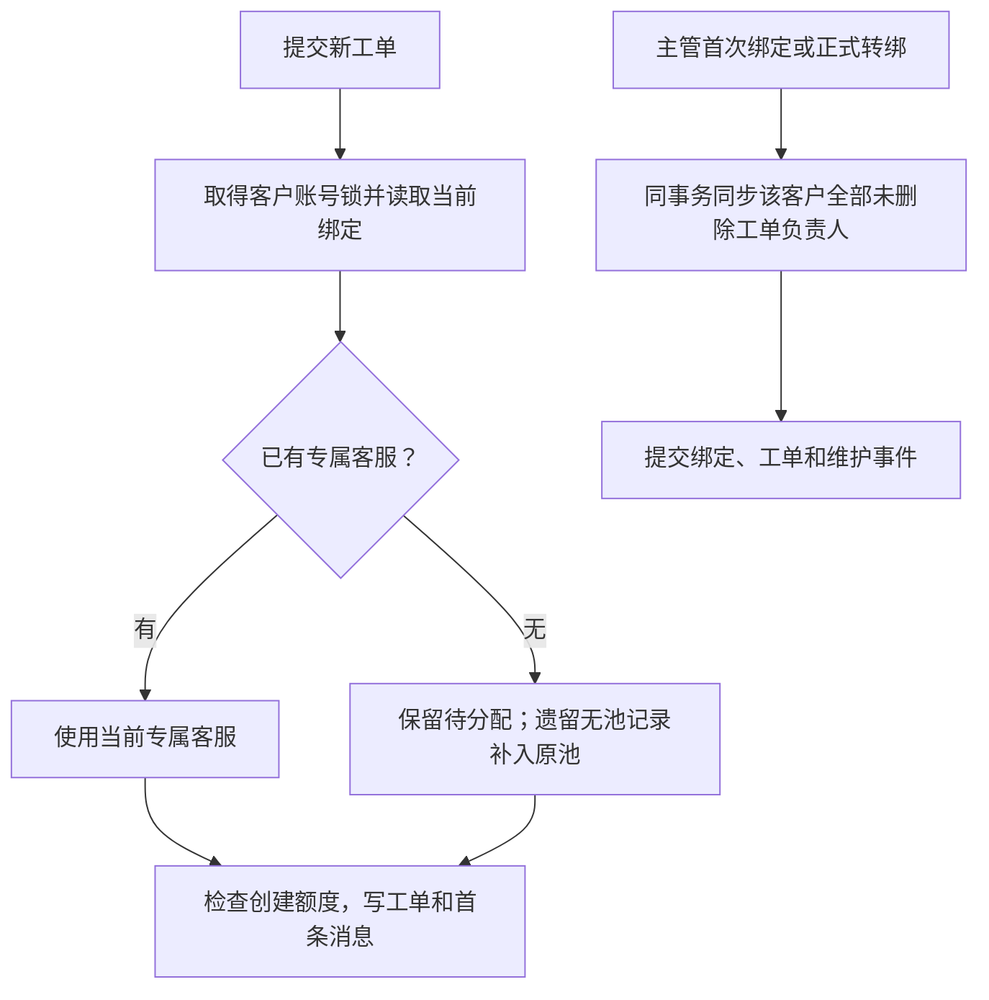

# 工单专属客服归属

## 目的与入口

工单的当前负责人必须对应客户当前的专属客服，不能与客户绑定分离。后台工单台入口为 `/service/tickets`，继续提供查询、回复、状态、优先级、内部备注、归档及升级会话。四类建单入口见[创建策略](support-ticket-creation-policy.md)；建单额度与归属均由服务端执行。

## 数据与展示

`nx_support_agent_user_assignment` 中同客户的 `ACTIVE`、未删除绑定是唯一归属来源。工单的 `assignedAdminId`、`assignedAdminName` 是当前责任人的投影，名字由服务端查询。已关闭和已归档工单也显示当前责任人；历史消息的 `senderId`、`senderType`、`senderName` 保留发送当时的作者。

客服忙碌、离线、停用或接待资格改变不自动解除既有绑定，也不将工单转给其他客服；不可接待的绑定由既有主管交接流程处理。无绑定时负责人为 `null` / `Unassigned`，界面显示待分配。

## 参数

本规则没有独立的可配置开关或运营绕过。注册继承资格、深度和待分配原因沿用原绑定规则；[创建额度参数](support-ticket-creation-policy.md#可控参数)保持独立。

## 操作与状态

- 未绑定也可提交工单。已有待分配记录及原因保持原样；遗留无绑定且无待分配记录的账号补入 `MIGRATION_REVIEW`，不自动挑选客服。
- 主管首次绑定、正式转绑及注册继承都在原事务内同步全部未删除工单的负责人；有差异时才增加工单版本。状态、归档标识、未读、消息数、消息内容和消息时间不变。
- 工单不再单独转交负责人。变更归属使用原主管客户分配流程及其理由、预期绑定版本和幂等键校验。
- 归属不匹配、工单写入或绑定同步失败时整个事务回滚，不能留下已关闭的源会话、部分工单或已换客服但未同步的工单。失败幂等回执可按既有规则重试。

## 接口与异常

| 接口/字段 | 契约 |
|---|---|
| 四类创建入口 | `assignedAdminId` 省略或为 `null` 时自动确定；传入值必须等于当前专属客服；来传姓名不作为依据 |
| `GET /api/admin/content/tickets/assignee-candidates` | 成功返回空数组，不再提供工单独立指派候选 |
| `PATCH /api/admin/content/tickets/{ticketNo}/assignee` | 保留路由，合法请求以 `409 SUPPORT_TICKET_OWNER_MANAGED_BY_BINDING` 拒绝，指引主管客户分配流程 |
| 显式指定其他负责人 | `409 SUPPORT_TICKET_OWNER_BINDING_MISMATCH`；刷新当前绑定后重试，不静默更换提交意图 |

错误沿用 `ApiResult`：实际 HTTP 409，`code=409`，`message` 为上述错误码，`data=null`。客户端显示专属客服归属提示，不显示内部代码。`assignedAdminId` 列表筛选按同步后的当前责任人工作。

成功幂等回执保持命令执行时的快照，不因转绑改写历史回执或重复建单。回放或命令恢复后查询工单详情，`GET` 详情中的负责人代表当前责任；旧回执的负责人不作为回复权限或当前归属依据。

## 权限与审计

App 只访问本人工单。后台建单和客户侧回复仍须满足原模块权限与当前专属客服写权限；仅有主管身份不替代当前客服写权限。既有 M2 状态、优先级、归档、内部备注协作授权保持不变。私聊转换副本继续遵守 [R08 阅读范围](specs/support-redesign-20260929/S3-R08-ticket-content.md)，负责人同步不扩大正文权限。

## 联动与事件

建单继续使用既有创建审计。绑定变化继续使用 `SUPPORT_ASSIGNMENT_CHANGED` 审计及同步维护事件；工单负责人同步在事件之前执行，同一事务失败一起回滚。不新增虚假的回复或消息事件，也不修改历史作者。

## 验收

四入口自动归属及越界指定拒绝；未绑定提交、首次绑定补齐及原池原因保留；忙碌/停用不改派；转绑覆盖活跃、关闭、归档工单并保留历史作者；建单与转绑两种并发顺序最终一致；工单同步故障回滚绑定与工单；当前客服回复和既有协作授权仍有效。

存量迁移 `20261003_support_ticket_binding_owner.sql` 在停服窗口执行，对齐旧工单并补必要待分配记录，成功标记保证重复启动不重复改写版本。它依赖原 S3 绑定结构；启动脚本先按 `support_ticket_owner_preflight.sql` 只读检查实际表与列，等价结构即使没有历史 S3 标记也可通过。缺前置时停止并给出缺失项，先按 [S3 部署流程](HANDOFF-support-s3.md) 审查和迁移，不自动裁决历史绑定冲突。

上线同时部署后台页面兼容调整，避免旧页面以任意指派候选作为新建或升级会话的前提。
